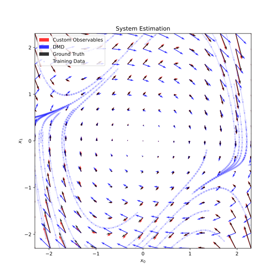

# Koopmania: Library for Koopman Operator Based Data-Driven Analysis



This is a (work in progress) little library to help me with research involving Koopman
operators. It features
* Estimators - scikit-like estimators to fit systems from data. These can be
continuous or discrete time systems.
* Observables - a way of creating Koopman observables easily. These can be
specified symbolically or numerically.

## Example Usage

### Create Systems

Create systems from symbolic equations

```python
import koopmania as km
import sympy as sp


# van der pol model
x0, x1 = sp.symbols('x0 x1')
xdot = [x1, (1 - x0**2) * x1 - x0]

my_system = km.SymbolicContinuousSystem((x0, x1), xdot)
```

### Create Observables

```python
import koopmania as km
import sympy as sp


# create observables from symbolic expressions
x0, x1 = sp.symbols('x0 x1')
observable_map = [sp.cos(0.5*x0 + 0.2*x1), sp.sin(x1)]
my_obs = km.SymbolicObservable((x0, x1), observable_map)

# use existing observables
q_obs = km.QuadraticObservable(2)

# combine observables together
obs = my_obs | q_obs
```

### Learn Systems from Data

```python
import koopmania as km


# learn a system from trajectory data X, Xn
obs = km.QuadraticObservable(2)
est = km.KoopmanSystemEstimator(obs, sampling_period=0.1)
est.fit(X, Xn)

# my learned system
est.system 


# predict the next state (after one sampling period)
est.predict(initial_value) 
```

### Visualize Systems
```python
import koopmania.visualizer as kviz
import matplotlib.pyplot as plt


# show vector field
fig, ax = plt.subplots() 
viewer = kviz.SystemViewer(system)
viewer.plot_quiver(ax)
plt.show()
```